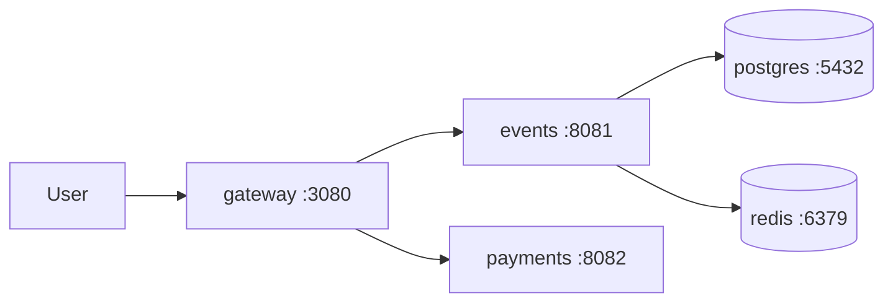

# Lab 1 — SRE Philosophy: Deploy, Break, Understand

## Made by: 
### Nurmukhametov Denis (d.nurmuhametov@innopolis.university)
## Task 1 — Deploy & Break QuickTicket (6 pts)

### 1.1 Deploy QuickTicket

```bash
cd app/
docker compose up --build -d
```

Output:
```
[+] Running 9/9
 ✔ app-payments              Built
 ✔ app-gateway               Built
 ✔ app-events                Built
 ✔ Network app_default       Created
 ✔ Container app-redis-1     Healthy
 ✔ Container app-payments-1  Started
 ✔ Container app-postgres-1  Healthy
 ✔ Container app-events-1    Started
 ✔ Container app-gateway-1   Started
```

### 1.2 Verify the System Works

```bash
docker compose ps
```

```
NAME             IMAGE                COMMAND                  SERVICE    STATUS                    PORTS
app-events-1     app-events           "uvicorn main:app --…"   events     Up 5 seconds
app-gateway-1    app-gateway          "uvicorn main:app --…"   gateway    Up 5 seconds              0.0.0.0:3080->8080/tcp
app-payments-1   app-payments         "uvicorn main:app --…"   payments   Up 12 minutes             0.0.0.0:8082->8082/tcp
app-postgres-1   postgres:17-alpine   "docker-entrypoint.s…"   postgres   Up 11 seconds (healthy)   0.0.0.0:5432->5432/tcp
app-redis-1      redis:7-alpine       "docker-entrypoint.s…"   redis      Up 12 minutes (healthy)   0.0.0.0:6379->6379/tcp
```

**Critical path — List events:**

```bash
curl -s http://localhost:3080/events | python3 -m json.tool
```

```json
[
    {
        "id": 1,
        "name": "Go Conference 2026",
        "venue": "Main Hall A",
        "date": "2026-09-15T09:00:00+00:00",
        "total_tickets": 100,
        "price_cents": 5000,
        "available": 100
    },
    {
        "id": 4,
        "name": "Python Workshop",
        "venue": "Lab 301",
        "date": "2026-09-22T14:00:00+00:00",
        "total_tickets": 25,
        "price_cents": 2000,
        "available": 25
    },
    {
        "id": 2,
        "name": "SRE Meetup",
        "venue": "Room 204",
        "date": "2026-10-01T18:00:00+00:00",
        "total_tickets": 30,
        "price_cents": 0,
        "available": 30
    },
    {
        "id": 5,
        "name": "Kubernetes Deep Dive",
        "venue": "Auditorium B",
        "date": "2026-10-10T10:00:00+00:00",
        "total_tickets": 80,
        "price_cents": 8000,
        "available": 80
    },
    {
        "id": 3,
        "name": "Cloud Native Summit",
        "venue": "Expo Center",
        "date": "2026-11-20T10:00:00+00:00",
        "total_tickets": 500,
        "price_cents": 15000,
        "available": 500
    }
]
```

**Critical path — Reserve 1 ticket for event 1:**

```bash
curl -s -X POST http://localhost:3080/events/1/reserve \
  -H "Content-Type: application/json" \
  -d '{"quantity": 1}' | python3 -m json.tool
```

```json
{
    "reservation_id": "75efd910-0ca6-4b35-9eab-a77e6186f223",
    "event_id": 1,
    "quantity": 1,
    "total_cents": 5000,
    "expires_in_seconds": 300
}
```

**Critical path — Pay for the reservation:**

```bash
curl -s -X POST http://localhost:3080/reserve/75efd910-0ca6-4b35-9eab-a77e6186f223/pay | python3 -m json.tool
```

```json
{
    "order_id": "75efd910-0ca6-4b35-9eab-a77e6186f223",
    "event_id": 1,
    "quantity": 1,
    "total_cents": 5000,
    "status": "confirmed"
}
```

**Health check when everything is healthy:**

```bash
curl -s http://localhost:3080/health | python3 -m json.tool
```

```json
{
    "status": "healthy",
    "checks": {
        "events": "ok",
        "payments": "ok",
        "circuit_payments": "CLOSED"
    }
}
```

### 1.3 Dependency Map

```
gateway:3080 → events:8081 → postgres:5432
gateway:3080 → events:8081 → redis:6379
gateway:3080 → payments:8082
```



**Architecture notes:**
- `gateway` is the single entry point — a stateless API router that proxies requests to backend services
- `events` manages ticket catalog (PostgreSQL), reservations (Redis), and confirmed orders (PostgreSQL)
- `payments` is a stateless mock processor with tunable failure injection via environment variables
- `postgres` persists event data and completed orders
- `redis` holds temporary reservations with a 5-minute TTL

### 1.4 Systematic Failure Exploration

### **Kill payments:**

```bash
docker compose stop payments
```
**List events trial**
```bash
curl -s http://localhost:3080/events | python3 -m json.tool
```

```json
[
    {
        "id": 1,
        "name": "Go Conference 2026",
        "venue": "Main Hall A",
        "date": "2026-09-15T09:00:00+00:00",
        "total_tickets": 100,
        "price_cents": 5000,
        "available": 96
    },
    {
        "id": 4,
        "name": "Python Workshop",
        "venue": "Lab 301",
        "date": "2026-09-22T14:00:00+00:00",
        "total_tickets": 25,
        "price_cents": 2000,
        "available": 20
    },
    {
        "id": 2,
        "name": "SRE Meetup",
        "venue": "Room 204",
        "date": "2026-10-01T18:00:00+00:00",
        "total_tickets": 30,
        "price_cents": 0,
        "available": 27
    },
    {
        "id": 5,
        "name": "Kubernetes Deep Dive",
        "venue": "Auditorium B",
        "date": "2026-10-10T10:00:00+00:00",
        "total_tickets": 80,
        "price_cents": 8000,
        "available": 78
    },
    {
        "id": 3,
        "name": "Cloud Native Summit",
        "venue": "Expo Center",
        "date": "2026-11-20T10:00:00+00:00",
        "total_tickets": 500,
        "price_cents": 15000,
        "available": 498
    }
]
```

**Reservation trial**
```
curl -s -X POST http://localhost:3080/events/1/reserve \
  -H "Content-Type: application/json" -d '{"quantity": 1}'
```

```json
{"reservation_id":"4e54e814-bb16-4d9b-a66f-15200952c166","event_id":1,"quantity":1,"total_cents":5000,"expires_in_seconds":300}
```
Reservation still works since events microservice is fully independent from events (no payment functionality is used for reservation, no resources are used in both events and payments)


**Payment trial**:
```bash
curl -s -X POST http://localhost:3080/reserve/4e54e814-bb16-4d9b-a66f-15200952c166/pay | python3 -m json.tool
```

```json
{
    "detail": "Payment service unavailable"
}
```
**Healthcheck**

```bash
curl -s http://localhost:3080/health | python3 -m json.tool
```

```json
{
    "status": "degraded",
    "checks": {
        "events": "ok",
        "payments": "down",
        "circuit_payments": "CLOSED"
    }
}
```

### **Kill events:**

```bash
docker compose stop events
```
**List events trial**
```bash
curl -s http://localhost:3080/events | python3 -m json.tool
```
```json
{
    "detail": "Events service unavailable"
}
```

**Reservation trial**
```bash
curl -s -X POST http://localhost:3080/events/1/reserve \
  -H "Content-Type: application/json" -d '{"quantity": 1}' | python3 -m json.tool
```

```json
{
    "detail": "Events service unavailable"
}
```
**Payment trial**

```bash
curl -s -X POST http://localhost:3080/reserve/4e54e814-bb16-4d9b-a66f-15200952c166/pay | python3 -m json.tool
```

```json
{
    "detail": "Payment succeeded but confirmation failed — contact support"
}
```
**Healthcheck**
```bash
curl -s http://localhost:3080/health | python3 -m json.tool
```

```json
{
    "status": "degraded",
    "checks": {
        "events": "down",
        "payments": "ok",
        "circuit_payments": "CLOSED"
    }
}
```

### **Kill redis:**

```bash
docker compose stop redis
```

**List events trial**
```bash
curl -s http://localhost:3080/events | python3 -m json.tool
```

```json
[
    {
        "id": 1,
        "name": "Go Conference 2026",
        "venue": "Main Hall A",
        "date": "2026-09-15T09:00:00+00:00",
        "total_tickets": 100,
        "price_cents": 5000,
        "available": 99
    },
    {
        "id": 4,
        "name": "Python Workshop",
        "venue": "Lab 301",
        "date": "2026-09-22T14:00:00+00:00",
        "total_tickets": 25,
        "price_cents": 2000,
        "available": 25
    },
    {
        "id": 2,
        "name": "SRE Meetup",
        "venue": "Room 204",
        "date": "2026-10-01T18:00:00+00:00",
        "total_tickets": 30,
        "price_cents": 0,
        "available": 30
    },
    {
        "id": 5,
        "name": "Kubernetes Deep Dive",
        "venue": "Auditorium B",
        "date": "2026-10-10T10:00:00+00:00",
        "total_tickets": 80,
        "price_cents": 8000,
        "available": 80
    },
    {
        "id": 3,
        "name": "Cloud Native Summit",
        "venue": "Expo Center",
        "date": "2026-11-20T10:00:00+00:00",
        "total_tickets": 500,
        "price_cents": 15000,
        "available": 500
    }
]
```
Events list still works, since they are read from PostgreSQL only

**Reservation trial**
```bash
curl -s -X POST http://localhost:3080/events/1/reserve \
  -H "Content-Type: application/json" -d '{"quantity": 1}' | python3 -m json.tool
```

```json
{
    "detail": "Events service timeout"
}
```
Temporal reservations are stored in Redis, which is down, so the events service times out.

**Payment trial**
```bash
curl -s -X POST http://localhost:3080/reserve/4e54e814-bb16-4d9b-a66f-15200952c166/pay | python3 -m json.tool
```
```json
{
    "detail": "Payment succeeded but confirmation failed — contact support"
}
```
**Healthcheck**
```bash
curl -s http://localhost:3080/health | python3 -m json.tool
```

```json
{
    "status": "degraded",
    "checks": {
        "events": "down",
        "payments": "ok",
        "circuit_payments": "CLOSED"
    }
}
```

### **Kill postgres:**

```bash
docker compose stop postgres
```

**List events trial**
```bash
curl -s http://localhost:3080/events | python3 -m json.tool
```
```json
{
    "detail": "Events service unavailable"
}
```
**Reservation trial**
```bash
curl -s -X POST http://localhost:3080/events/1/reserve \
  -H "Content-Type: application/json" -d '{"quantity": 1}'
```

```
Internal Server Error
```
**Payment trial**
```bash
curl -s -X POST http://localhost:3080/reserve/4e54e814-bb16-4d9b-a66f-15200952c166/pay | python3 -m json.tool
```

```json
{
    "detail": "Payment succeeded but confirmation failed \u2014 contact support"
}
```
**Healthcheck**
```bash
curl -s http://localhost:3080/health | python3 -m json.tool
```

```json
{
    "status": "degraded",
    "checks": {
        "events": "degraded",
        "payments": "ok",
        "circuit_payments": "CLOSED"
    }
}
```

**Failure table:**

| Component Killed | Events List | Reserve                          | Pay                                                                  | Health Check                | User Impact                                       |
|---|---|----------------------------------|----------------------------------------------------------------------|-----------------------------|---------------------------------------------------|
| **payments** | ✅ Works | ✅ Works                          | ❌ 502 — "Payment service unavailable"                                | degraded (payments: down)   | Browsing and reservations work; purchases blocked |
| **events** | ❌ 502 — "Events service unavailable" | ❌ 502 - "Events service unavailable"                         | ❌ 500 — "Payment succeeded but confirmation failed — contact support" | degraded (events: down)     | Full outage — nothing works                       |
| **redis** | ✅ Works | ❌ 504 — "Events service timeout" | ❌ 500 — "Payment succeeded but confirmation failed — contact support" | degraded (events: down)     | Browsing works; reservations and payments broken  |
| **postgres** | ❌ 502 — "Events service unavailable" | ❌ 500 — Internal Server Error    | ❌ 500 "Payment succeeded but confirmation failed — contact support"                                                               | degraded (events: degraded) | Total outage since events are DB dependent        |

**Key observations from failure exploration:**

1. **payments is the most isolated failure** — it only breaks the pay endpoint. Browsing and reservations continue to work, demonstrating good separation of concerns in the architecture.
2. **redis failure is interesting** — events list still works because it reads from PostgreSQL. However, reserve fails with a 504 timeout rather than a clean error, because the events service tries to connect to Redis and eventually times out. A timeout-based reservation system could be improved with a cached Redis health check.
3. **postgres failure is catastrophic** — since events relies on PostgreSQL for both reads and writes, taking down the database takes down the entire system except payments (which is independent).
4. **"Payment succeeded but confirmation failed — contact support"** is a dangerous state — when events or redis is killed after a charge succeeds but before confirmation, the user is charged but has no ticket.

### 1.5 Load Generator

**Run 1 — All services healthy:**

```bash
./app/loadgen/run.sh 5 30
```

```
QuickTicket Load Generator
Target: http://localhost:3080 | RPS: 5 | Duration: 30s
---
[10s] requests=43 success=43 fail=0 error_rate=0%
[10s] requests=44 success=44 fail=0 error_rate=0%
[10s] requests=45 success=45 fail=0 error_rate=0%
[10s] requests=46 success=46 fail=0 error_rate=0%
[10s] requests=47 success=47 fail=0 error_rate=0%
[20s] requests=88 success=88 fail=0 error_rate=0%
[20s] requests=89 success=89 fail=0 error_rate=0%
[20s] requests=90 success=90 fail=0 error_rate=0%
[20s] requests=91 success=91 fail=0 error_rate=0%
---
Done. total=132 success=131 fail=1 error_rate=.7%
```

**Run 2 — Payments killed during load:**

```bash
# In another terminal: docker compose stop payments
./app/loadgen/run.sh 5 30
```

```
QuickTicket Load Generator
Target: http://localhost:3080 | RPS: 5 | Duration: 30s
---
[10s] requests=44 success=39 fail=5 error_rate=11.3%
[10s] requests=45 success=40 fail=5 error_rate=11.1%
[10s] requests=46 success=40 fail=6 error_rate=13.0%
[10s] requests=47 success=41 fail=6 error_rate=12.7%
[20s] requests=89 success=80 fail=9 error_rate=10.1%
[20s] requests=90 success=81 fail=9 error_rate=10.0%
[20s] requests=91 success=82 fail=9 error_rate=9.8%
[20s] requests=92 success=83 fail=9 error_rate=9.7%
---
Done. total=133 success=120 fail=13 error_rate=9.7%
```

**Analysis:** When payments is killed, the error rate jumps from ~0.7% to ~9.7%. The 9.7% figure corresponds to the ~10% of requests in the load generator mix that attempt the full purchase flow (reserve + pay), since those are the only requests that hit the payments service. The other 90% of traffic (list events, reserve) continues to succeed.

---

## Task 2 — Graceful Degradation (3 pts)

### 2.1 Code Change

Added a specific `except httpx.ConnectError` handler to catch the case when payments is unreachable, returning a clear 503 with an actionable message:

```bash
git diff app/gateway/main.py
```

```diff
diff --git a/app/gateway/main.py b/app/gateway/main.py
index c86db33..d638a8a 100644
--- a/app/gateway/main.py
+++ b/app/gateway/main.py
@@ -336,6 +336,11 @@ async def pay_reservation(reservation_id: str):
         raise HTTPException(504, "Payment service timeout")
     except httpx.HTTPStatusError as e:
         raise HTTPException(e.response.status_code, "Payment failed")
+    except httpx.ConnectError:
+        return JSONResponse(status_code=503, content={
+            "error": "payments_unavailable",
+            "message": "Payment service is temporarily down. Your reservation is held — try again in a few minutes.",
+            "reservation_id": reservation_id,})
     except Exception as e:
         log.error(f"payment error: {e}")
         raise HTTPException(502, "Payment service unavailable")
```

### 2.2 Verification

```bash
docker compose stop payments
curl -s -X POST http://localhost:3080/events/1/reserve \
  -H "Content-Type: application/json" -d '{"quantity": 1}'
```

Reservation still works when payments is down:
```json
{"reservation_id":"c2c2e1c9-ecb3-43e9-8710-99df4977a07e","event_id":1,"quantity":1,"total_cents":5000,"expires_in_seconds":300}
```

```bash
curl -s -X POST http://localhost:3080/reserve/c2c2e1c9-ecb3-43e9-8710-99df4977a07e/pay
```

Payment returns a clear 503 with actionable message:
```json
{"error":"payments_unavailable","message":"Payment service is temporarily down. Your reservation is held — try again in a few minutes.","reservation_id":"c2c2e1c9-ecb3-43e9-8710-99df4977a07e"}
```

### 2.3 Analysis

The change adds a specific `except httpx.ConnectError` clause before the generic `except Exception` handler. When the payments container is stopped, the HTTP client raises `ConnectError` rather than a generic exception. By catching it first, the gateway returns a meaningful `503` with the reservation ID instead of a generic `502`. The reservation remains in Redis for 5 minutes (the `RESERVATION_TTL`), so the user can retry payment once the service recovers without losing their reservation.

The ordering is critical — `except httpx.ConnectError` must come before `except Exception`, otherwise the generic handler would catch everything and the specific 503 would never be reached.

---

## Task 3 — GitHub Community Engagement (1 pt)

### 3.1 GitHub Community Section

Completed all required actions:
- **Starred** the course repository and [simple-container-com/api](https://github.com/simple-container-com/api)
- **Followed** professor [@Cre-eD](https://github.com/Cre-eD) and TAs [@Naghme98](https://github.com/Naghme98), [@pierrepicaud](https://github.com/pierrepicaud)
- **Followed** 3+ classmates from the course

**Why starring repositories matters in open source:**

Stars serve as bookmarks for projects you find interesting or useful, making it easy to rediscover them later. Beyond personal organization, star counts act as a trust signal for the community — a higher star count indicates popularity and community validation, which helps good projects gain visibility and attracts maintainers and contributors. For project authors, stars are a meaningful form of encouragement that shows their work is valued.

**How following developers helps in team projects and professional growth:**

Following developers on GitHub provides visibility into their public activity — projects they contribute to, repositories they star, and discussions they participate in. This creates opportunities to discover new tools and practices, learn from how experienced engineers structure their work, and identify potential collaborators. In a team context, following classmates and colleagues makes it easier to stay connected with their professional growth and find opportunities for pair programming or knowledge sharing.

---

## Bonus Task — Resource Usage Under Load (2 pts)

### B.1 Baseline (Idle)

```bash
docker stats --no-stream --format "table {{.Name}}\t{{.CPUPerc}}\t{{.MemUsage}}\t{{.NetIO}}\t{{.PIDs}}"
```

```
NAME             CPU %     MEM USAGE / LIMIT     NET I/O         PIDS
app-gateway-1    0.19%     42.58MiB / 14.86GiB   2.44kB / 126B   1
app-events-1     0.00%     49.31MiB / 14.86GiB   2.49kB / 126B   1
app-payments-1   0.18%     52.63MiB / 14.86GiB   7.58kB / 126B   1
app-postgres-1   0.02%     43.13MiB / 14.86GiB   0B / 0B         6
app-redis-1      0.63%     13.54MiB / 14.86GiB   7.74kB / 126B   6
```

### B.2 Under Load (10 RPS)

```bash
# Terminal 1: ./app/loadgen/run.sh 10 30
# Terminal 2: docker stats --no-stream ...
```

```
NAME             CPU %     MEM USAGE / LIMIT     NET I/O          PIDS
app-gateway-1    6.57%     46.63MiB / 14.86GiB   195kB / 191kB    2
app-events-1     4.29%     52.53MiB / 14.86GiB   111kB / 98.6kB   2
app-payments-1   0.16%     52.63MiB / 14.86GiB   7.99kB / 126B    1
app-postgres-1   2.85%     43.94MiB / 14.86GiB   0B / 0B          6
app-redis-1      2.82%     13.73MiB / 14.86GiB   8.78kB / 565B    6
```

### B.3 Under Stress with Fault Injection

```bash
docker compose stop payments
PAYMENT_FAILURE_RATE=0.3 PAYMENT_LATENCY_MS=500 docker compose up -d payments
# Load generator still running at 10 RPS
docker stats --no-stream --format "table {{.Name}}\t{{.CPUPerc}}\t{{.MemUsage}}\t{{.NetIO}}\t{{.PIDs}}"
```

```
NAME             CPU %     MEM USAGE / LIMIT     NET I/O         PIDS
app-payments-1   0.15%     34.46MiB / 14.86GiB   2.65kB / 126B   1
app-gateway-1    6.14%     47.32MiB / 14.86GiB   462kB / 457kB   2
app-events-1     4.38%     52.88MiB / 14.86GiB   261kB / 234kB   2
app-postgres-1   0.00%     44.37MiB / 14.86GiB   0B / 0B         6
app-redis-1      0.52%     13.32MiB / 14.86GiB   8.91kB / 565B   6
```

### B.4 Analysis

| Metric | Idle | Load | Chaos (fault injection) |
|--------|------|------|-------------------------|
| **Gateway CPU** | 0.19% | 6.57% | 6.14% |
| **Gateway memory** | 42.58 MiB | 46.63 MiB | 47.32 MiB |
| **Events CPU** | 0.00% | 4.29% | 4.38% |
| **Events memory** | 49.31 MiB | 52.53 MiB | 52.88 MiB |
| **Payments CPU** | 0.18% | 0.16% | 0.15% |
| **Payments memory** | 52.63 MiB | 52.63 MiB | 34.46 MiB\* |
| **Postgres CPU** | 0.02% | 2.85% | 0.00% |
| **Redis CPU** | 0.63% | 2.82% | 0.52% |

\*Payments memory dropped after restart because a new container was created.

**Which service uses the most memory? Does it change under load?**

Under idle and normal load, payments uses the most memory (~52.63 MiB), closely followed by events (~49-53 MiB) and postgres (~43-44 MiB). Memory usage is relatively stable across all scenarios — the variations are within 3-4 MiB. Redis is the lightest service at ~13.5 MiB. The memory leader changes only when payments is restarted with new env vars, which creates a fresh container with lower reported memory.

**Which service uses the most CPU under load? Why?**

Gateway uses the most CPU under load (6.57%). This is expected because gateway handles every incoming request: it parses the HTTP request, forwards it to the appropriate backend (events or payments), waits for the response, and sends it back. Every event list, reservation, and payment goes through gateway first. Events is second at 4.29% — it handles both read queries (listing events from PostgreSQL) and write operations (reserving tickets in Redis + PostgreSQL). Postgres and Redis show similar CPU usage (~2.8%) since they serve the events service's queries.

**How does fault injection in payments affect resource usage in gateway?**

With `PAYMENT_LATENCY_MS=500`, each payment charge takes at least 500ms. This causes the gateway to hold HTTP connections open longer while waiting for the payments response. We observe a slight memory increase in gateway from 46.63 MiB (normal load) to 47.32 MiB (chaos), likely from additional in-flight request tracking. The gateway CPU remains similar (~6.14-6.57%), suggesting that waiting on I/O does not consume significant CPU — the connections are simply held open, occupying memory rather than processing power.
